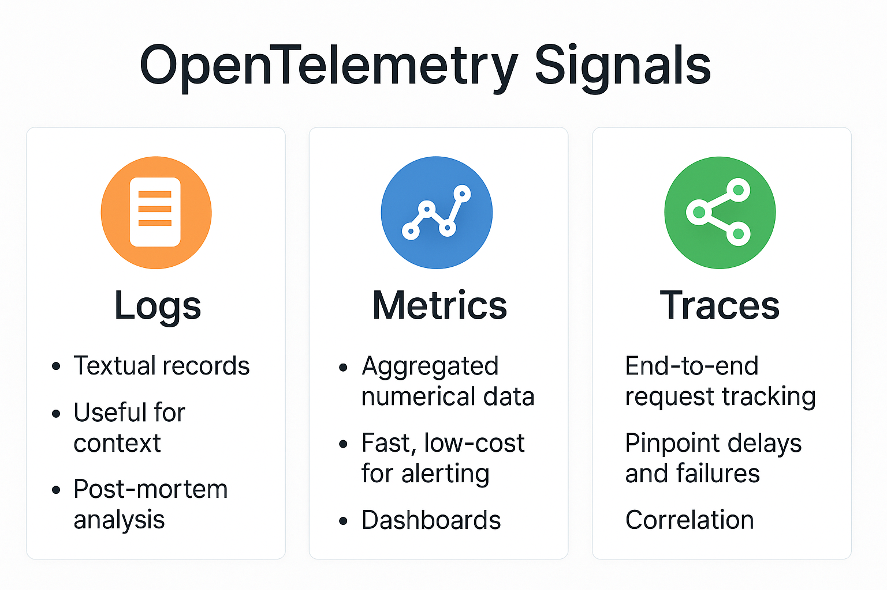
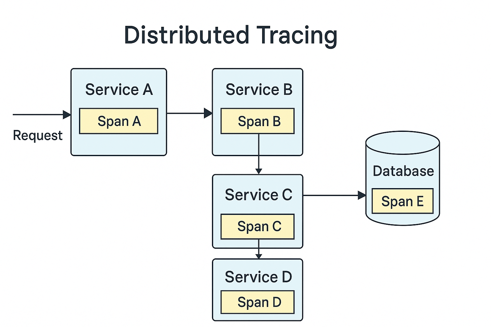
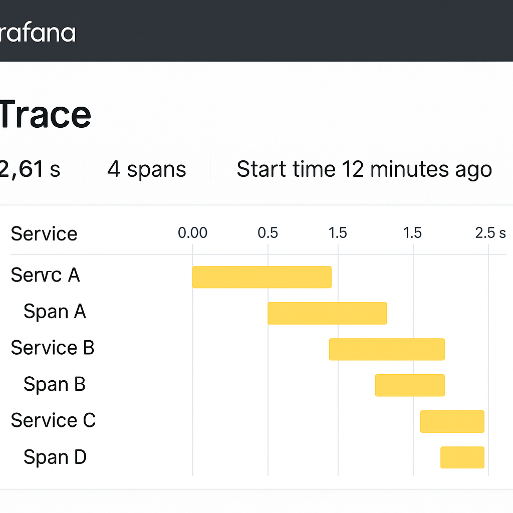

# Why You Need Full Observability

## Introduction to Observability

Observability is the ability to understand what is happening inside your systems based on the data they produce. Traditionally, logs have been the primary tool for diagnosing issues. However, modern distributed systems demand more comprehensive observability using three pillars of telemetry: logs, metrics, and traces.

Vendor-neutral, open standards such as [OpenTelemetry](https://opentelemetry.io) provide a unified way to collect and correlate all three types of signals, enabling better insight into systems' behavior.

> ✅ OpenTelemetry is a CNCF project that supports automatic and manual instrumentation for many programming languages and platforms.

### Supported Programming Languages for OpenTelemetry

**Automatic Instrumentation** (via agents or instrumentation libraries):

* Java (with Java Agent)
* .NET
* Python
* Node.js
* Ruby
* PHP

**Manual Instrumentation**:

* Java
* .NET (C#)
* Go
* Python
* Node.js (JavaScript/TypeScript)
* Ruby
* C++
* Swift
* Rust (community-supported)
* Erlang/Elixir (community-supported)

> 🔧 Auto-instrumentation can be as simple as attaching a Java agent or initializing a library in Python. Manual instrumentation gives you full control and flexibility.

Grafana OSS provides a full observability stack with the following components:

* **Loki** for logs
* **Mimir** for metrics
* **Tempo** for traces
* **Grafana** for unified visualization

> 💡 Grafana is also available as a commercial product with enterprise features, hosted options, and support.

---

## Why Logs Alone Aren’t Enough

Many organizations rely solely on logs. However, this often results in:

* Incomplete context
* Difficult correlation between services
* Slow root cause analysis

Logs are useful for understanding discrete events and forensics, but they lack the dimensional view needed for proactive alerting and tracing the flow of requests.

---

## What Are the Three Telemetry Signals?

### Logs

* Textual, unstructured or structured
* Good for error details and manual inspection

### Metrics

* Numeric, aggregated
* Ideal for monitoring health, throughput, and alerting

### Traces

* Visual representation of request flow
* Best for understanding bottlenecks and dependencies

---

## Introduction to Distributed Tracing

Distributed tracing allows you to track a single request across multiple microservices, showing where time is spent and where failures happen.

Here’s a conceptual diagram of a trace through multiple services:

Each box represents a service, and each “Span” shows how long that part of the request took. Spans are stitched together into a Trace.

> 🔍 Distributed tracing is essential for identifying performance problems in complex systems.

A powerful feature of distributed tracing is that spans can be marked with error information. This allows engineers to:

* Quickly identify traces that contain errors
* Focus troubleshooting on problematic services
* Understand the impact and context of failures in distributed workflows

You can search for traces with error-marked spans directly within Grafana Tempo’s UI.

---

## How Traces Look in Grafana

Grafana (with Tempo) visualizes traces in an intuitive timeline view:

You can immediately see which services participated in a request, how long each one took, and where delays occurred.

---

## From Traces to Metrics with Tempo Metrics Generator

**Grafana Tempo** can generate metrics from traces using the **Tempo Metrics Generator**. This allows you to:

* Extract metrics such as request rates, error rates, and latency percentiles from spans
* Automatically transform spans into RED metrics (Rate, Errors, Duration)
* Route those metrics to Mimir or any Prometheus-compatible backend

This closes the loop between tracing and monitoring, enabling efficient SLO tracking and alerting based on trace-derived metrics.

---

## Alerting with Grafana and Mimir

You can define **Alert Rules** based on metrics stored in **Mimir**, including those generated from spans via Tempo.

* Create Prometheus-style recording and alerting rules
* Set thresholds and conditions (e.g., latency > 500ms, error rate > 5%)
* Trigger **Alerts** that can be routed to Slack, Teams, email, PagerDuty, etc.
* Use Grafana’s Alerting UI or config-as-code with the Grafana Alerting system

Alert rules can also be configured to trigger when:

* Spans are marked with errors
* Spans exceed a defined latency threshold (e.g., exceptional long execution time)

> 🚨 Alerting enables proactive issue detection and faster incident response.

---

## The Solution Stack

A proposed stack for full observability:

* **OpenTelemetry Collector** – centralized agent to receive and forward telemetry
* **Instrumentation** – libraries or auto-instrumentation for your apps
* **Loki, Mimir, Tempo** – store logs, metrics, and traces
* **Grafana** – one UI to query and correlate all signals
* **Tempo Metrics Generator** – derives metrics from traces
* **Alerting** – rules and alert channels based on metrics and SLOs

---

## Summary of Benefits

| Benefit                     | Logs Only          | Full Observability (OTel + Grafana Stack) |
| --------------------------- | ------------------ | ----------------------------------------- |
| Correlation across services | ❌                  | ✅                                         |
| Root cause analysis speed   | ⏳                  | ⚡                                         |
| Alerting and dashboards     | ⚠️ (limited)       | ✅                                         |
| Unified view                | ❌                  | ✅                                         |
| Trace-based metrics         | ❌                  | ✅                                         |
| Open standard               | ❌ (vendor lock-in) | ✅ (OpenTelemetry)                         |

---

## Final Thoughts

Relying solely on logs is no longer sufficient for diagnosing and understanding complex application behavior. A full observability solution built on open standards like OpenTelemetry and visualized with the Grafana stack empowers engineering teams to detect, troubleshoot, and resolve issues faster and with greater confidence.

---

## Bonus: Commercial Support

Grafana offers commercial options with advanced features, enterprise plugins, 24/7 support, and managed cloud services — ideal for production environments or teams that need enhanced SLAs and integrations.

---

Let’s bring full visibility into your systems — so you don’t just react to problems, you understand and prevent them.
